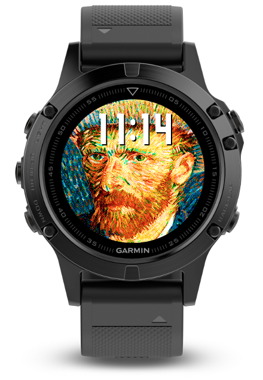

# Garmin Van Gogh

A quick proof-of-concept watchface to display a 6-bit 240x240 bitmap on a Garmin wearable.

## How it works

It's difficult to load and render a 240x240 full colour bitmap on a Garmin watchface, as they are memory constrained.

This explores the idea of splitting up a large bitmap into 4 segments. Rendering to the frame buffer is done in succession; load segment of bitmap, draw segment, free resources, then repeat.

This is (deliberately) illustrated on "onExitSleep()", where the rendering is done one frame at a time.
